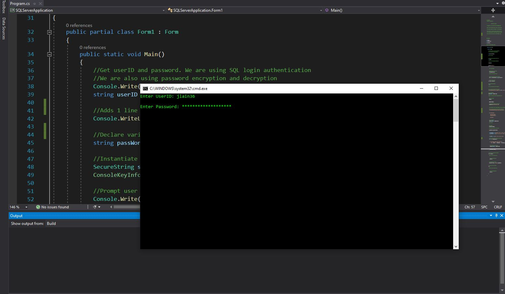
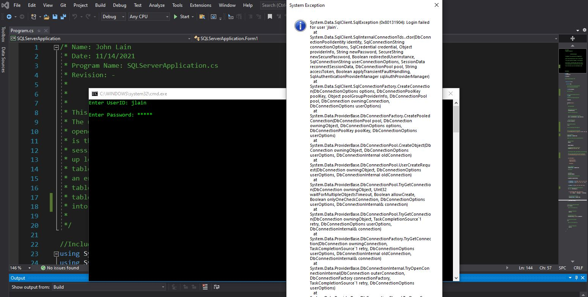
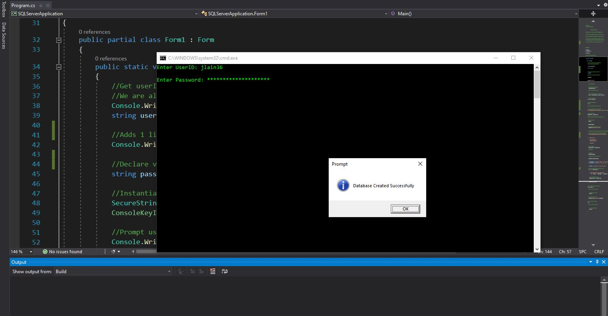
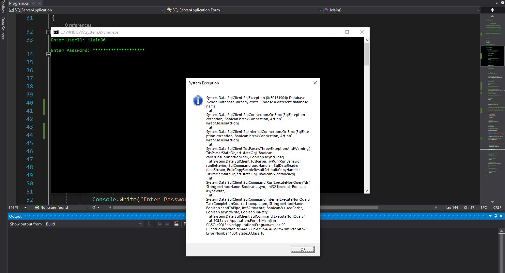
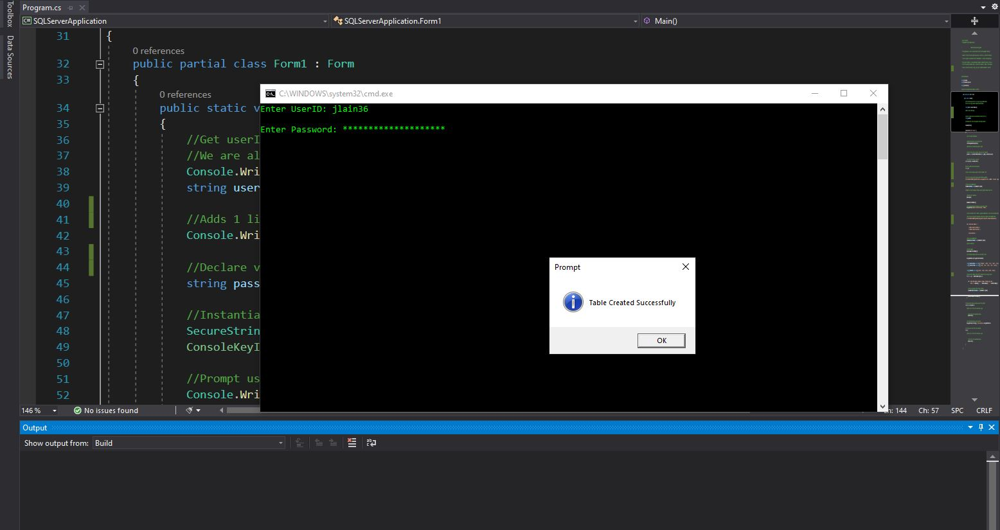
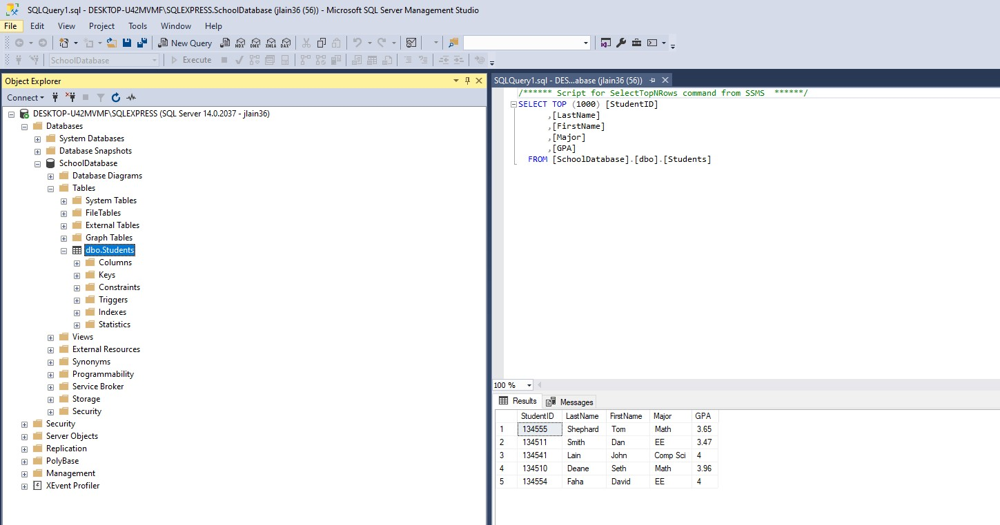

## Enhancement Three: Databases

I chose to create a new database project for the databases component of the CS-499 Capstone project. This project uses the C# programming language as a client, and the Microsoft SQL Server Management Studio 18 for the actual database. This is my own project that isn’t a previous artifact developed through the coursework at SNHU. I developed this project earlier this month and have made small refinements to it since. 

I selected this artifact for my ePortfolio because it demonstrates my proficiency of getting up to speed very quickly utilizing a new programming language to accomplish a real-world task. Employers in the software community want C# programming skills and experience. This is certainly a new tool I can use to market my skills and abilities through my ePortfolio to prospective employers. In addition, my skills and abilities utilizing an Object Orientated Programming (OOP) language, such as C#, is in high demand today. All of the software engineering jobs I have seen on sites such as Indeed and Monster prefer candidates with a background in OOP. I veered outside of my comfort zone with this project.

I decided to use the Microsoft SQL Server Management Suite because again, it is another tool and skill I can showcase to future employers. Seeing how this project was created from scratch, I added the features and functionality using my own creativity. My C# program first prompts the user to enter a username and password using secure authentication. When the password is typed the “*” character is displayed to the console rather than the actual password. The username and password are used to authenticate the MS SQL server session. If the username and/or password is incorrect, the program will throw a system level exception letting the user know the entered credentials were incorrect. The program will only continue if the correct credentials are authenticated. 

The username and password component of this project is the only interaction between the program and the user. A predetermined database name called “SchoolDatabase” is automatically created within MS SQL if it doesn’t already exist. If it does already exist, the program will throw a system level exception letting the user know that it already exists. It will not be overwritten.  Next, a predetermined database table name called “Students” is automatically created within MS SQL. Finally, five rows of predetermined student information, such as StudentID, LastName, FirstName, Major, and GPA are automatically inserted into the table. The MS SQL server session is then closed before the program terminates.

I exceeded the objectives I planned to meet in the 1-4 ePortfolio Selection and Refinement Plan with this project. I am proud of my new gained abilities and skills utilizing C# and MS SQL. To be honest, I was a little stressed out when I started this project, not having a previous project to build from. My database design for this project demonstrates my ability to utilize the appropriate computer science practices, standards, and tools which are appropriate for this project in a professional context. 

In addition, the features I added to this project implements computer solutions that adds value and accomplishes industry specific goals in software engineering and design. I approached this project from the beginning with a security mindset with the inclusion of secure login credentials and password encryption. My code is also well commented with meaningful descriptions as to what the code is actually doing.  

This project was a lot of fun for me, especially learning C#. The biggest challenge I faced was connecting C# to MS SQL. This took me a lot of time and tinkering to get working. Another challenging aspect was the secure password authentication. I really wanted to get this feature working, and I was proud of myself and my abilities when I did. I learned that C# is a very powerful language. While I basically scratched the surface with C#, I plan to continue learning the language because I see the value of its functionality. 

Connecting to servers is actually not that hard in C# and MS SQL, provided you have the appropriate privileges and skills to do so. Additionally, I learned that the error handling in C# is awesome. For me this whole project was a huge learning curve. This project would have been more difficult to program in C++ in my opinion. Another awesome feature of C# that I learned is the ability to effortlessly add resources and built-in assemblies (dll’s) to the project. So basically, just about any C# template in MS Visual Studio will work regardless of the project. The figures below highlight my programs’ functionality.  

Database Secure Authentication

Database Secure Authentication Failed Error

Database Created Successfully

Database Already Exists Error

Database Table Created Successfully

Database Table Populated in MS SQL

**Link to Repository**

[Enhancement Three Repository](https://github.com/jlain36/Enhancement_Three)

**Porfolio Links** 
* [Professional Self-Assessment](https://jlain36.github.io/index.html) 
* [Refinement Plan and Code Review](https://jlain36.github.io/Code_Review.html) 
* [Enhancement One](https://jlain36.github.io/Enhancement_One.html) 
* [Enhancement Two](https://jlain36.github.io/Enhancement_Two.html) 
* [Enhancement Three](https://jlain36.github.io/Enhancement_Three.html)
